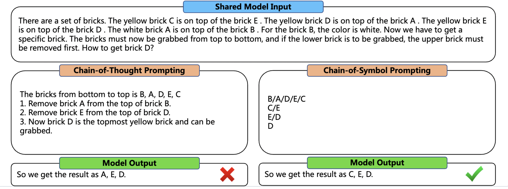
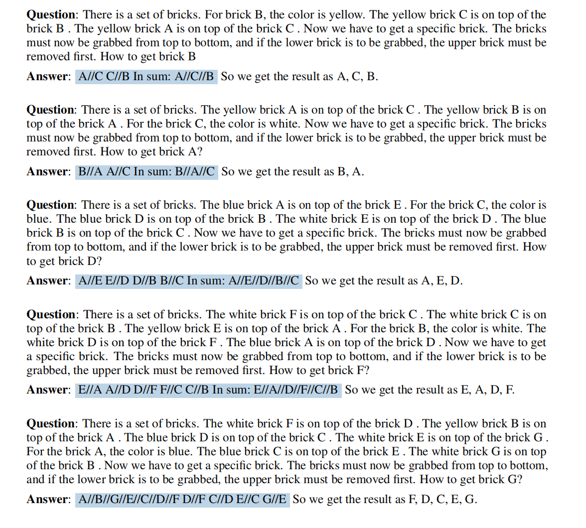

# Chain-of-Symbol Prompting Elicits Planning in Large Language Models


Code and data of paper: _Chain-of-Symbol Prompting Elicits Planning in Large Language Models_. 2023

Hanxu Hu. Westlake Unversity; Hongyuan Lu. the Chinese University of Hong Kong

[Paper pdf](https://arxiv.org/pdf/2305.10276.pdf)

> We take the initiative to investigate the performance of LLMs on complex planning tasks that require LLMs to understand a virtual spatial environment simulated via natural language and act correspondingly in text. We propose a benchmark named Natural Language Planning (NLP) composed of a set of novel tasks: Brick World, NLVR-based Manipulations, and Natural Language Navigation. We found that current popular LLMs such as ChatGPT still lack abilities in complex planning. This arises a question -- do the LLMs have a good understanding of the environments described in natural language, or maybe other alternatives such as symbolic representations are neater and hence better to be understood by LLMs? To this end, we propose a novel method called CoS (Chain-of-Symbol Prompting) that represents the complex environments with condensed symbolic spatial representations during the chained intermediate thinking steps. CoS is easy to use and does not need additional training on LLMs. Extensive experiments indicate that CoS clearly surpasses the performance of the Chain-of-Thought (CoT) Prompting in all three planning tasks with even fewer tokens used in the inputs compared with CoT on ChatGPT and InstructGPT. The performance gain is strong, by up to 60.8% accuracy (from 31.8% to 92.6%) on Brick World for ChatGPT. CoS also reduces the number of tokens in the prompt obviously, by up to 65.8% of the tokens (from 407 to 139) for the intermediate steps from demonstrations on Brick World.



## 📖 Benchmark Description
We propose the Natural Language Planning (NLP) benchmark for exploring the planning abilities of current LLMs. 

NLP is composed of three virtual spatial environments: Brick Words, NLVR-based (Suhr et al. [2017]) Manipulation, and Natural Language Navigation

We have created the data of 2000 instances of Brick World 1D for 4 settings, 2000 instances of Brick World 2D for 4 settings, 1000 instances of NVLR-based Manipunation, and 500 instances of Natural Language Navigation, you can view them in *./data*

You can also costomize your own Natural Language Planning data by modifying *create_bricks.py*, *create_navigate.py*, and *create_nlvr.py* .
## 🎵 Chain-of-Symbol Demonstration


Above is one example of 5-shot demostration for brick 1d.
You can use them follow the quickstart. And you can create your own demos and upload them in *./demo* !

## 👀 Quickstart
```bash
pip install -r requirements.txt
```

```bash
api_key=<YOUR_OPENAI_API_KEY>
cd running;
python test_brick.py\
   --prompt_type "cos"\
   --num 1\
   --setting "shuffle_both"\
   --model_name "chatgpt"\
   --key ${api_key}

```
This is to use chatgpt with Chain-of-Symbol (CoS) prompting in Brick World 1d task, and in "shuffle both" setting.
The outputs will be saved in *.results/chatgpt_results/*. 

For arguments, "prompt_type" has two options: "cos" and "cot", which represents Chain-of-Symbol (CoS) prompting and Chain-of-Thought (CoS) prompting respectively, and "setting" has four options: "shuffle_both", "shuffle_label", "shuffle_descpt", and "noshuffle". And "model_name" now support 2 options: "chatgpt" and "text-davinci-003".


or you can also adjust the parameters in test_brick.sh, then:
```bash
bash test_brick.sh
```

For NLVR-based Manipunation:
firstly change the api key in test_navigation_nlvr.sh, then:
```bash
bash test_navigation_nlvr.sh
```


## 📝 Evaluation
You can do evaluation direclty:

```bash
cd eval;
python eval_prompt.py;
python eval_nlvr.py;
python eval_navigation.py;
```


## Citation 
Please cite our paper if you find the resource is useful:
```
@misc{hu2023chainofsymbol,
      title={Chain-of-Symbol Prompting Elicits Planning in Large Langauge Models}, 
      author={Hanxu Hu and Hongyuan Lu and Huajian Zhang and Wai Lam and Yue Zhang},
      year={2023},
      eprint={2305.10276},
      archivePrefix={arXiv},
      primaryClass={cs.CL}
}
```
